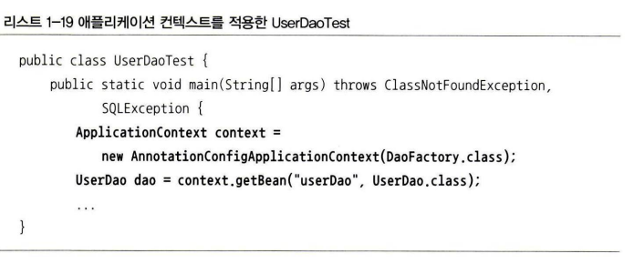
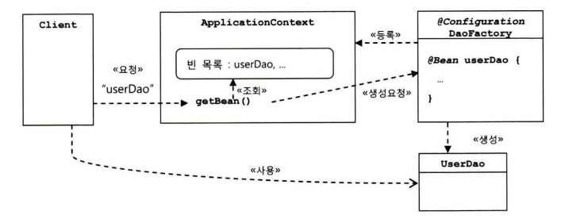
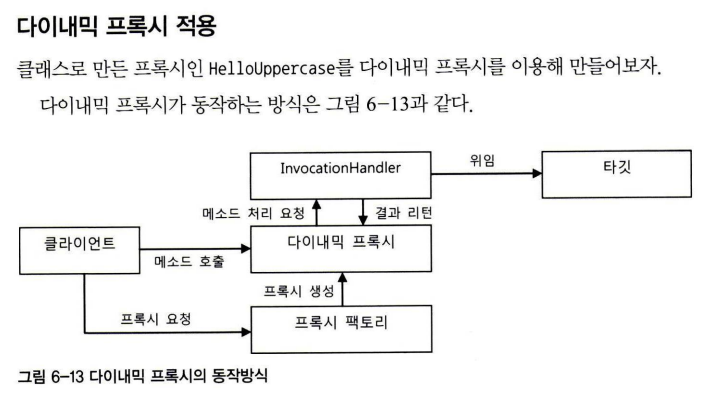
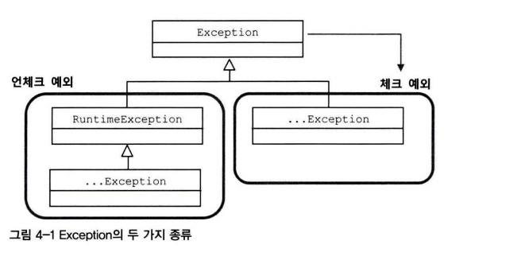

# 자기소개
 * 안녕하세요 6년차 개발자 노은석입니다  
   6년차 개발자로 다양한 프로젝트의 개발/운영 경험이 있습니다.  
   WMS / WCS 개발에 참여하여 창고관리 시스템 및 미니로드 제어 개발과  
   스타필드 앱 운영을 한 경험이 있으며 최근에는 자가격리자를 위한 앱의 DB설계/백엔드 개발/배포 환경 구축 등 
   전체적인 개발을 진행한 경험이 있습니다.  
   저는 그동안 다양한 언어와 업무의 프로젝트를 진행하며 얻은 경험으로 습득력과 적응력이 빠릅니다.  
   또한 손이 먼저 나가는 개발을 하는 것이 아닌 먼저 생각하고 개발을 하는 것을 원칙으로 삼고 있습니다.  
   에러나 버그가 발생하지 않기 위해 최선을 다하고 상세하고 꼼꼼한 개발을 하고자 합니다.  
   제가 개발한 코드에 항상 의구심을 품고 더 나은 코드를 작성하기 위해 자기계발을 멈추지 않고  
   계속 성장하며 발전하는 개발자가 되고싶은 노은석입니다.

# 이직사유
 * 재직중인 회사에서는 앞으로의 개발 실력에 있어 발전과 성장이 제한적이라는 생각이 들었습니다.
   또한 팀장급 선임이 없어 기술과 업무적인 부분에 대한 배움의 기회가 단절되었습니다.
   엔터플에는 실력이 출중하신 팀장이 계시다는 이야기를 듣고 이직을 결정하게 되었습니다.

# 기업 정보 씽크트리
  * 엔터플의 대표 상품은 SyncTree로써, 코딩 없이 모듈화된 다양한 기능 블록을 ‘Drag & Drop’’으로 결합하여 Business Logic 생성부터 서비스의 Microservice 구현 그리고 API의 생성, 관리, 테스트, 배포, DevOps까지의 모든 작업을 한 개의 툴에서 할 수 있는 ‘No Code API Solution'입니다.

    SyncTree는 개발 언어 및 환경에 상관없이 모든 환경을 지원하고 있어 계정만 생성하면 사용자가 원하는 공간에서 웹으로 로그인해서 SaaS처럼 바로 작업을 시작할 수 있습니다.

# 하고싶은 질문
  * 연구과제라 함은 주로 어떤 프로젝트를 진행하게 되는지?
  * 전자정부 프레임워크를 사용하는지?
  * 업무지원 및 사내교육이 정확히 어떤 것인지?
  * 팀장님이 생각하시는 이상적인 개발자의 모습이 어떤것인지?

# 애플리케이션 컨텍스트 동작 방식

* ©Configuration이 붙은 DaoFactory는 이 애플리케이션 컨텍스트가 활용하는 loC
  설정정보다. 내부적으로는 애플리케이션 컨텍스트.가 DaoFactory의 userDao() 메소드
  를 호출해서 오브젝트를 가져온 것을 클라이언트가 getBean() 으로 요청할 때 전달해준다.
  
* 애플리케이션 컨텍스트는 DaoFactory 클래스를 설정정보로 등록해두고 @Bean이 붙은
  메소드의 이름을 가져와 빈 목록을 만들어둔다. 클라이언트가 애플리케이션 컨텍스트
  의 getBeanO 메소드를 호출하면 자신의 빈 목록에서 요청한 이름이 있는지 찾고, 있다
  면 빈을 생성하는 메소드를 호출해서 오브젝트를 생성시킨 후 클라이언트에 돌려준다

## 애플리케이션 컨텍스트를 사용했을때의 장점
* 클라이언트는 구체적인 팩토리 클래스를 알 필요가 없다
* 애플리케이션 컨텍스트는 종합 loC 서비스를 제공해준다
* 애플리케이션 컨텍스트는 빈을 검색하는 다양한 방법을 제공한다

# 제어의 역전 IOC
* 제어의 역전이란 이런 제어 흐름의 개념을 거꾸로 뒤집는 것이다.  
  제어의 역전에서는 오브젝트가 자신이 사용할 오브젝트를 스스로 선택하지 않는다. 당연히 생성하지도
  않는다. 또 자신도 어떻게 만들어지고 어디서 사용되는지를 알 수 없다. 모든 제어 권한
  을 자신이 아닌 다른 대상에게 위임하기 때문이다.   
  프로그램의 시작을 담당하는 main()과 같은 엔트리 포인트를 제외하면 모든 오브젝트는 이렇게 위임받은 제어 권한을 갖는
  특별한 오브젝트에 의해 결정되고 만들어진다
* 클래스가 자신이 사용할 오브젝트를 스스로 선택 하지 않는다.
* 스프링은 IOC를 극한으로 활용하는 프레임워크다
* 애플리케이션 코드는 프레임워크 틀 안에서 수동적으로 동작해야한다
* 대표적인 사용 예로는 서블릿 프레임워크 템플릿메서드 패턴

# 애플리케이션 컨텍스트와 싱글턴 레지스트리
* 애플리케이션 컨텍스트는 우리가 만들었던 오브젝트 팩토리와 비슷한 방식으로 동작하
  는 loC 컨테이너다.  
  그러면서 동시에 이 애플리케이션 컨텍스트는 싱글톤을 저장하고
  관리하는 싱글톤 레지스트리 이기도 하다.  
  스프링은 기본적으로 별다른 설정을 하지 않으면 내부에서 생성하는 빈 오브젝트를
  모두 싱글톤으로 만든다.   
  여기서 싱글톤이라는 것은 디자인 패턴에서 나오는 싱글톤 패턴과 비슷한 개념 이 지만 그 구현 방법은 확연히 다르다.

* 스플링이 빈을 싱글톤으로 만드는 이유는 수만 수천개의 요청이 들어올때마다 각 로직을 담당하는 오브젝트를 생성하게 되면
  가비지 컬렉터의 성능이 좋아졌더라도 감당하기 힘들기 때문에 서비스 오브젝트라는 개념을 사용한다

# 오브젝트의 동일성과 동등성
* 자바에서는 두 개의 오브젝트가 완전히 같은 동일한(identical) 오브젝트라고 말하는 것과, 동일한 정보를 담고 있는
  (equivalent) 오브젝트라고 말하는 것은 분명한 차이가 있다.   
  전자는 동일성(identity) 비교라고 하고, 후자를 동등성(equality) 비교라고 한다.   
  동일성은 == 연산자로. 동등성은 equalst) 메소드를 이용해 비교한다

# 의존성 주입
* 클래스 모델이나 코드에는 런타임 시점의 의존관계가 드러나지 않는다. 그러기 위해서는 인
  터페이스에만 의존하고 있어야 한다.
* 런타임 시점의 의존관계는 컨테이너나 팩토리 같은 제3의 존재가 결정한다.
* 의존관계는 사용할 오브젝트에 대한 레퍼 런스를 외부에서 제공（주입）해줌으로써 만들어진
* DI를 원하는 오브젝트는 먼저 자기 자신이 컨테이너가 관리하는 빈이 돼야 한다는
  사실을 잊지 말자. (컨테이너가 생성과 초기화 권한을 가져야 하기때문에)
* 의존성 검색은 getBean()를 이용하고 빈이 아니여도 가능하다.
* 단지 외부에서 파라미터로 오브젝트를 넘겨줬다고 해서, 즉 주입해줬다고 해서 다 이가 아니라는 점을 주의해야 한다.   
* 주입받는 메소드 파라미터가 이미 특정 클래스 타입으로 고정되어 있다면 이가 일어날 수 없다
  DI에서 말하는 주입은 다이내믹하게 구현 클래스를 결정해서 제공받을 수 있도록 인터페이스 타입
  의 파라미터를 통해 이뤄져야 한다.

# 다이나믹 프록시

# 트랜잭션
* 트랜잭션의 기본 개념은 더 이상 쪼갤 수 없는 최소 단위의 작업이다.   
  따라서 트랜잭션 경계 안에서 진행된 작업은 commits을 통해 모두 성공하든지 아니면 rollbackO을
  통해 모두 취소돼야 한다

### 전파속성
* PROPAGATION.REQUIRED  
  가장 많이 사용되는 트랜잭션 전파 속성이다. 진행 중인 트랜잭션이 없으면 새로 시
  작하고, 이미 시작된 트랜잭션이 있으면 이에 참여한다. PROPAGATION_REQUIRED 트
  랜잭션 전파 속성을 갖는 코드는 다양한 방식으로 결합해서 하나의 트랜잭션으로
  구성하기 쉽다. A와 日가 모두 PROPAGATION_REQUIRED로 선언되어 있다면, A. B,
  A—B, B—A와 같은 네 가지의 조합된 트랜잭션이 모두 가능하다.
  DefaultTransactionDefinition의 트랜잭션 전파 속성은 바로 이 PROPAGATION—
  REQUIRED다.
* PROPAGATION_REQUIRES_NEW  
  항상 새로운 트랜잭션을 시작한다. 즉 앞에서 시작된 트랜잭션이 있든 없든 상관없
  이 새로운 트랜잭션을 만들어서 독자적으로 동작하게 한다. 독립적인 트랜잭션이 보
  장돼야 하는 코드에 적용할 수 있다.
* PROPAGATION_NOT_SUPPORTED  
  이 속성을 사용하면 트랜잭션 없이 동작하도록 만들 수도 있다. 진행 중인 트랜잭션
  이 있어도 무시한다. 트랜잭션 없이 동작하게 할 거라면 뭐하러 트랜잭션 경계를 설
  정해두는 것일까? 그냥 트랜잭션 경계설정을 하지 않으면 되는 게 아닐까?
  트랜잭션을 무시하는 속성을 두는 데는 이유가 있다. 트랜잭션 경계설정은 보통
  AOP를 이용해 한 번에 많은 메소드에 동시에 적용하는 방법을 사용한다. 그런데 그
  중에서 특별한 메소드만 트랜잭션 적용에서 제외하려면 어떻게 해야 할까? 물론 포
  인트컷을 잘 만들어서 특정 메소드가 AOP 적용 대상이 되지 않게 하는 방법도 있
  겠지만 포인트컷이 상당히 복잡해질 수 있다. 그래서 차라리 모든 메소드에 트랜잭
  션 AOP가 적용되게 하고, 특정 메소드의 트랜잭션 전파 속성만 PROPAGATION_NOT_
  SUPPORTED로 설정해서 트랜잭션 없이 동작하게 만드는 편이 낫다

### 프록시 방식 AOP는 같은 타깃 오브젝트 내의 메소드를 호출할 때는 적용되지 않는다
* 이건 전략이라기보다는 주의사항이다. 프록시 방식의 AOP에서는 프록시를 통한 부가
기능의 적용은 클라이언트로부터 호출이 일어날 때만 가능하다.   
여기서 클라이언트는 인터페이스를 통해 타깃 오브젝트를 사용하는 다른 모든 오브젝트를 말한다. 
반대로 타깃 오브젝트가 자기 자신의 메소드를 호출할 때는 프록시를 통한 부가기능의 적용이 일
어나지 않는다.

# AOP
* 스프링은 프록시 방식의 AOP를 사용한다
* 

# 스프링 시큐리티 jwt

# jpa

# 디자인패턴
* 전략 패턴
* 상태 패턴
* 옵저버 패턴
* 데코레이터 패턴
* 싱글턴 패턴
* 컴포지트 패턴
* 반복자 패턴
* 프록시 패턴
* 템플릿 메서드 패턴
* 추상 팩토리 패턴
* 팩토리 메서드 패턴

# 객체지향 원칙

# Maria DB

# 네트워크

# 알고리즘
* 버블 정렬
* 선택 정렬
* 삽입 정렬
* 병합 정렬
* 퀵 정렬
* 순차 탐색
* 이분 탐색
* 동적 계획법 (상향식 / 메모이제이션)
* 재귀 (하향식 / 분할 정복)

# 자료구조
* 배열
* 링크드 리스트
* 해쉬 테이블 (충돌기법 : 폐쇄해싱 / 체이닝)
* 힙
* 큐 (FIFO)
* 스택 (LIFO)
* 트리

# docker

# 예외

### Error
* 에러는 시스템에 뭔가 비정상
  적인 상황이 발생했을 경우에 사용된다. 그래서 주로 자바 VM에서 발생시키는 것이
  고 애플리케이션 코드에서 잡으려고 하면 안 된다. OutOfMemoryError나 ThreadDeath
  같은 에러는 catch 블록으로 잡아봤자 아무런 대응 방법이 없기 때문이다.
  따라서 시스템 레벨에서 특별한 작업을 하는 게 아니라면 애플리케이션에서는 이
  런 에러에 대한 처리는 신경 쓰지 않아도 된다.

### Exception과 체크 예외
* 일반적으로 예외라고 하면 Exception 클래스의 서브클래스 중에서
  RuntimeException을 상속하지 않은 것만을 말하는 체크 예외라고 생각해도 된다. 체
  크 예외가 발생할 수 있는 메소드를 사용할 경우 반드시 예외를 처리하는 코드를 함
  께 작성해야 한다. 사용할 메소드가 체크 예외를 던진다면 이를 catch 문으로 잡든
  지, 아니면 다시 throws를 정의해서 메소드 밖으로 던져야 한다. 그렇지 않으면 컴파
  일 에러가 발생한다.

### RuntimeException과 언체크/런타임 예외
* java. lang.RuntimeException 클래스를 상속한 예외들은 명시적인 예외처리를 강제
  하지 않기 때문에 언체크 예외라고 불린다. 또는 대표 클래스 이름을 따서 런타임 예외라고도 한다.   
  에러와 마찬가지로 이 런타임 예외는 catch 문으로 잡거나 throws로
  선언하지 않아도 된다. 물론 명시적으로 잡거나 throws로 선언해줘도 상관없다.

* 런타임 예외는 주로 프로그램의 오류가 있을 때 발생하도록 의도된 것들이다. 대
  표적으로 오브젝트를 할당하지 않은 레퍼런스 변수를 사용하려고 시도했을 때 발생
  하는 NullPointerException이나, 허용되지 않는 값을 사용해서 메소드를 호출할 때
  발생하는 IllegalArgumentException 등이 있다. 이런 예외는 코드에서 미리 조건을
  체크하도록 주의 깊게 만든다면 피할 수 있다. 피할 수 있지만 개발자가 부주의해서
  발생할 수 있는 경우에 발생하도록 만든 것이 런타임 예외다. 따라서 런타임 예외는
  예상하지 못했던 예외상황에서 발생하는 게 아니기 때문에 굳이 catch나 throws를
  사용하지 않아도 되도록 만든 것이다.

# TDD 
* 테스트를 수행하는 데 필요한 정보나 오브젝트를 픽스처fixture라고 한다. 일반적으로 픽
  스처는 여러 테스트에서 반복적으로 사용되기 때문에 ©Before 메소드를 이용해 생성해
  두면 편리하다